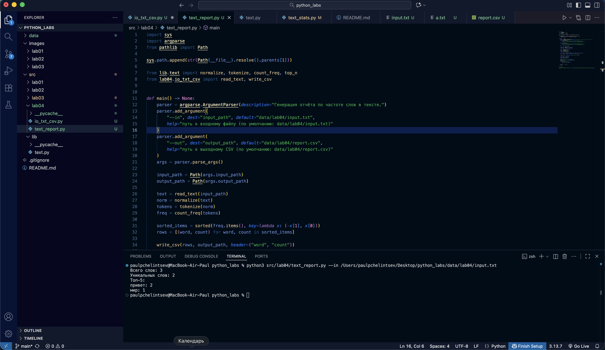
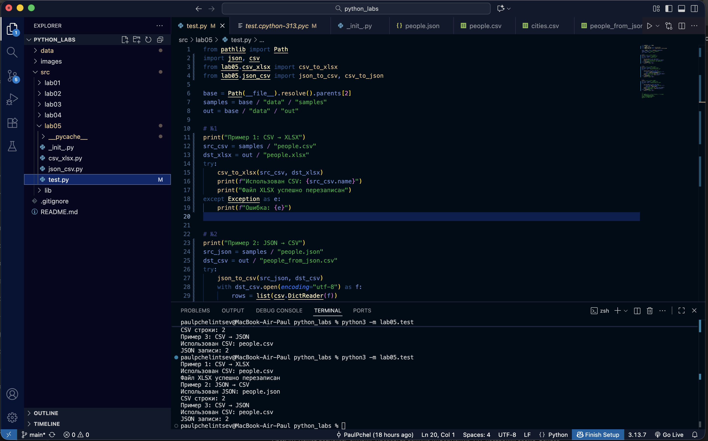
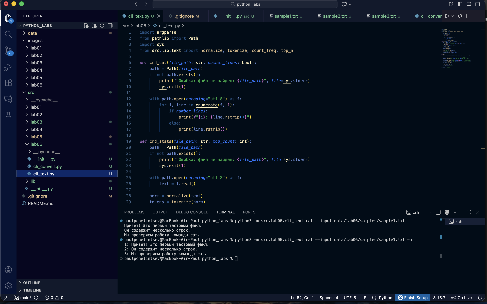
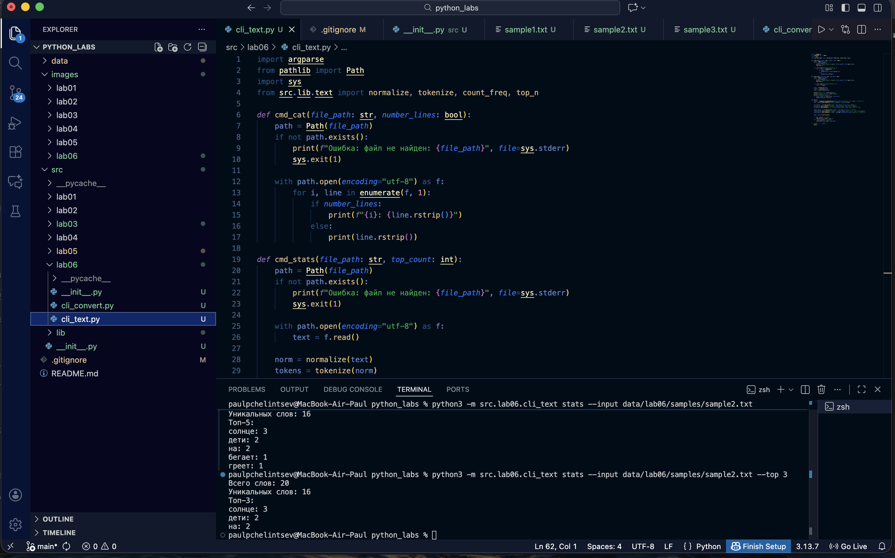
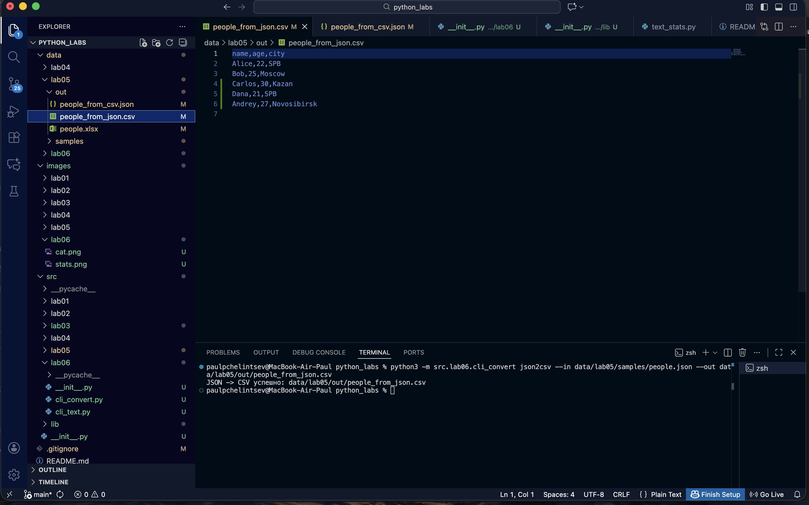
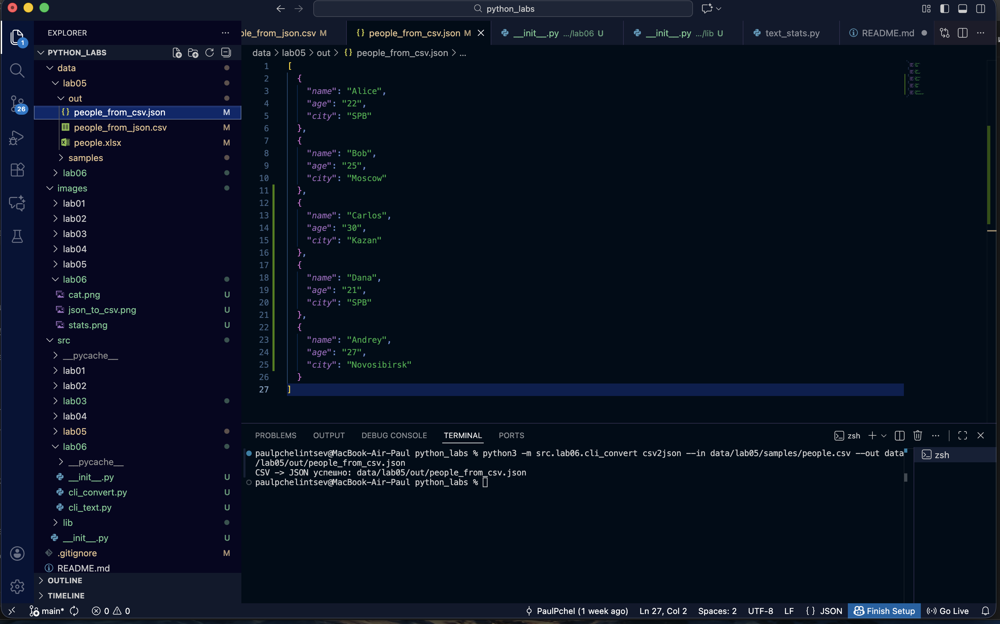
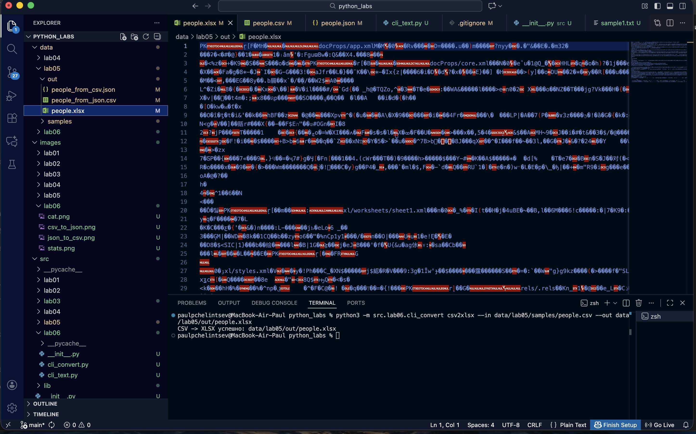
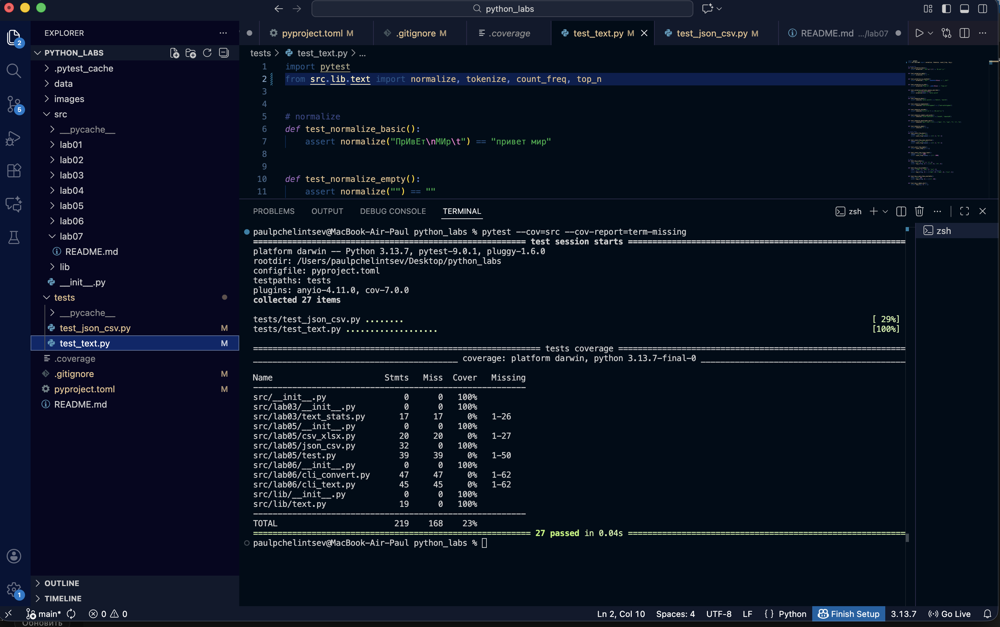

# Лабораторная работа 1
## Задание 1


```
name=str(input('Имя: '))
age=int(input('Возраст: '))
print(f'Привет, {name}! Через год тебе будет {age+1}.')
```

## Задание 2


```
a=float(input('a: ').replace(',','.'))
b=float(input('b: ').replace(',','.'))
sum=round(a+b,2)
avg=round(sum/2,2)
print(f'sum={sum}; avg={avg}')
```

## Задание 3


```
price=float(input('Цена: '))
discount=float(input('Скидка: '))
vat=float(input('НДС: '))

base=round(price*(1 - discount/100),2)
vat_amount=round(base*(vat/100),2)
total=round(base+vat_amount,2)

print(f'База после скидки: {base} ₽')
print(f'НДС:               {vat_amount} ₽')
print(f'Итого к оплате:    {total} ₽')
```

## Задание 4


```
m=int(input("Минуты: "))
hours=m//60
minutes=m%60
print(f'{hours}:{minutes:02d}')
```

## Задание 5


```
name=input("ФИО: ")

parts=name.strip().split()
final=" ".join(parts)

initials=''.join(i[0].upper() for i in parts)
length=len(final)

print(f"Инициалы: {initials}.")
print(f"Длина (символов): {length}")
```

## Задание 6


```
n = int(input('Количество: '))
ochno = 0
zaochno = 0

for i in range(n):
    line=input('Участник: ').split()
    format_uch=line[-1]

    if format_uch=="True":
        ochno+=1
    else:  
        zaochno+=1

print(ochno, zaochno)
```

## Задание 7


```
s = input().strip()

start=0
for i, ch in enumerate(s):
    if ch.isupper():
        start=i
        break

second=0
for i, ch in enumerate(s):
    if ch.isdigit() and i+1<len(s):
        second=i+1
        break

step=second- start

result=''
i=start
while i<len(s):
    if s[i]=='.':
        result+='.'
        break
    result+=s[i]
    i+=step

print(result)
```


# Лабораторная работа 2
## Задание 1

### arrays(min_max)
.png)

```
from typing import List, Tuple

def min_max(nums: List[float|int]) -> Tuple[float|int, float|int]:
    if not nums:
        return 'ValueError'   

    min_val = max_val = nums[0]
    for x in nums[1:]:
        if x < min_val:
            min_val = x
        if x > max_val:
            max_val = x

    return min_val, max_val
```

### arrays(unique_sorted)
.png)

```
from typing import List

def unique_sorted(nums: List[float | int]) -> List[float | int]:
    unique: List[float | int] = []
    
    for x in nums:
        if x not in unique:
            unique.append(x)
    
    unique.sort()
    
    return unique
```

### arrays(flatten)
.png)

```
from typing import List

def flatten(mat: List[list | tuple]) -> List:
    result: List = []
    for row in mat:
        if not isinstance(row, (list, tuple)):
            return ('TypeError')
        for elem in row:
            result.append(elem)
    return result
```

## Задание B

### matrix(transpose)
.png)

```
from typing import List

def transpose(mat: List[List[float|int]]) -> List[List]:
    if not mat:
        return []

    row_len = len(mat[0])
    if any(len(row) != row_len for row in mat):
        return 'ValueError'
    
    return [list(col) for col in zip(*mat)]
```

### matrix(row_sums)
.png)

```
from typing import List

def row_sums(mat: List[List[float|int]]) -> List[float]:
    if not mat:
        return []
    
    row_len = len(mat[0])
    if any(len(row) != row_len for row in mat):
        return 'ValueError'
    
    return [sum(row) for row in mat]
```

### matrix(col_sums)
.png)

```
from typing import List

def col_sums(mat:List[List[float|int]]) -> List[float]:
    if not mat:
        return []
    
    row_len = len(mat[0])
    if any(len(row) != row_len for row in mat):
        return 'ValueError'
    
    return [sum(row[i] for row in mat) for i in range(row_len)]
```

## Задание C


```
def format_record(rec: tuple[str, str, float]) -> str:

    fio, group, gpa = rec
    if not (isinstance(fio, str) and isinstance(group, str)) or not isinstance(gpa, (int, float)):
        return 'Неверные типы данных'
    
    parts = " ".join(fio.strip().split()).split()
    if len(parts) < 2 or not group.strip():
        return 'Некорректное ФИО или группа'
    
    surname = parts[0].capitalize()
    initials = "".join(p[0].upper() + "." for p in parts[1:3])
    
    return f'{surname} {initials}, гр. {group.strip()}, GPA {gpa:.2f}'
```


# Лабораторная работа 3
## Задание A

### normalize
.png)

```
import re

def normalize(text: str, *, casefold: bool = True, yo2e: bool = True) -> str:
    text = re.sub(r'[\r\n\t\f\v]', ' ', text)

    if yo2e:
        text = text.replace('ё', 'е').replace('Ё', 'Е')

    if casefold:
        text = text.casefold()

    text = re.sub(r'\s+', ' ', text).strip()

    return text

print(normalize('ПрИвЕт\nМИр\t'))
print(normalize('ёжик, Ёлка'))
print(normalize('Hello\r\nWorld'))
print(normalize('  двойные   пробелы  '))
```

### tokenize
.png)

```
import re

def tokenize(text: str) -> list[str]:
    return re.findall(r'\w+(?:-\w+)*', text, flags=re.UNICODE)

print(tokenize('привет мир'))
print(tokenize('hello,world!!!'))
print(tokenize('по-настоящему круто'))
print(tokenize('2025 год'))
print(tokenize('emoji 😀 не слово'))
```

### count_freq
.png)

```
def count_freq(tokens: list[str]) -> dict[str, int]:
    freq: dict[str, int] = {}
    for token in tokens:
        freq[token] = freq.get(token, 0) + 1

    sorted_items = sorted(freq.items(), key=lambda x: (-x[1], x[0]))

    return dict(sorted_items)

print(count_freq(['a', 'b', 'a', 'c', 'b', 'a']))
print(count_freq(['bb', 'aa', 'bb', 'aa', 'cc']))
```

### top_n
.png)

```
def top_n(freq: dict[str, int], n: int = 5) -> list[tuple[str, int]]:
    sorted_items = sorted(freq.items(), key=lambda x: (-x[1], x[0]))
    return sorted_items[:n]

freq1 = {'a': 3, 'b': 2, 'c': 1}
print(top_n(freq1, n=2))

freq2 = {'bb': 2, 'aa': 2, 'cc': 1}
print(top_n(freq2, n=2))
```

## Задание B

### text_stats


```
import sys
import os

sys.path.append(os.path.join(os.path.dirname(__file__), '..'))

from lib.text import normalize, tokenize, count_freq, top_n

def main() -> None:
    text = sys.stdin.read().strip()

    norm = normalize(text)
    tokens = tokenize(norm)
    freq = count_freq(tokens)

    print(f"Всего слов: {len(tokens)}")
    print(f"Уникальных слов: {len(freq)}")
    print("Топ-5:")
    for word, count in top_n(freq, 5):
        print(f"{word}:{count}")

if __name__ == "__main__":
    main()

"""
1. Сначала вставляешь в терминал  python3 src/lab03/text_stats.py
2. Затем втсавляешь текст, то есть Привет, мир! Привет!!!
3. Потом клавишами CTRL+D
"""
```


# Лабораторная работа 4
## Задание A

### io_txt_csv

```
from pathlib import Path
import csv


def read_text(path: str | Path, encoding: str = "utf-8") -> str:
    """
    Прочитать текстовый файл и вернуть его содержимое как одну строку.

    Исключения:
        FileNotFoundError: если файл не найден.
        UnicodeDecodeError: если содержимое не может быть декодировано указанной кодировкой.
    """
    path = Path(path)
    with path.open("r", encoding=encoding) as f:
        return f.read()


def write_csv(
    rows: list[tuple | list],
    path: str | Path,
    header: tuple[str, ...] | None = None
) -> None:
    """
    Создать или перезаписать CSV-файл с разделителем запятая (,).

    Исключения:
        ValueError: если строки в `rows` имеют разную длину.
    """
    if not rows:
        with Path(path).open("w", newline="", encoding="utf-8") as f:
            writer = csv.writer(f)
            if header:
                writer.writerow(header)
        return

    expected_len = len(rows[0])
    if any(len(row) != expected_len for row in rows):
        raise ValueError("Все строки должны иметь одинаковую длину")

    path = Path(path)
    with path.open("w", newline="", encoding="utf-8") as f:
        writer = csv.writer(f)
        if header:
            writer.writerow(header)
        writer.writerows(rows)
```

## Задание B

### text_report


```
import sys
import argparse
from pathlib import Path

sys.path.append(str(Path(__file__).resolve().parents[1]))

from lib.text import normalize, tokenize, count_freq, top_n
from lab04.io_txt_csv import read_text, write_csv


def main() -> None:
    parser = argparse.ArgumentParser(description="Генерация отчёта по частоте слов в тексте.")
    parser.add_argument(
        "--in", dest="input_path", default="data/lab04/input.txt",
        help="путь к входному файлу (по умолчанию: data/lab04/input.txt)"
    )
    parser.add_argument(
        "--out", dest="output_path", default="data/lab04/report.csv",
        help="путь к выходному CSV (по умолчанию: data/lab04/report.csv)"
    )
    args = parser.parse_args()

    input_path = Path(args.input_path)
    output_path = Path(args.output_path)

    text = read_text(input_path)
    norm = normalize(text)
    tokens = tokenize(norm)
    freq = count_freq(tokens)

    sorted_items = sorted(freq.items(), key=lambda x: (-x[1], x[0]))
    rows = [(word, count) for word, count in sorted_items]

    write_csv(rows, output_path, header=("word", "count"))

    total_words = len(tokens)
    unique_words = len(freq)
    top5 = top_n(freq, 5)

    print(f"Всего слов: {total_words}")
    print(f"Уникальных слов: {unique_words}")
    print("Топ-5:")
    for word, count in top5:
        print(f"{word}: {count}")


if __name__ == "__main__":
    main()

"""
Для запуска:
python3 src/lab04/text_report.py --in /Users/paulpchelintsev/Desktop/python_labs/data/lab04/input.txt
"""
```


# Лабораторная работа 5
## Задание A

### iJSON ↔ CSV (json_csv)

```
import json
import csv
from pathlib import Path

def json_to_csv(json_path: str, csv_path: str) -> None:
    json_file = Path(json_path)
    csv_file = Path(csv_path)

    if not json_file.exists():
        raise FileNotFoundError(f"Файл не найден: {json_path}")
    if not json_file.suffix.lower() == ".json":
        raise ValueError("Неверный тип файла, ожидается .json")

    with json_file.open(encoding="utf-8") as f:
        data = json.load(f)

    if not data or not isinstance(data, list) or not all(isinstance(x, dict) for x in data):
        raise ValueError("Пустой JSON или неподдерживаемая структура")

    fieldnames = list(data[0].keys())

    # Только создаём файл, если его ещё нет
    if not csv_file.exists():
        with csv_file.open("w", newline="", encoding="utf-8") as f:
            writer = csv.DictWriter(f, fieldnames=fieldnames)
            writer.writeheader()
            writer.writerows(data)


def csv_to_json(csv_path: str, json_path: str) -> None:
    csv_file = Path(csv_path)
    json_file = Path(json_path)

    if not csv_file.exists():
        raise FileNotFoundError(f"Файл не найден: {csv_path}")
    if not csv_file.suffix.lower() == ".csv":
        raise ValueError("Неверный тип файла, ожидается .csv")

    with csv_file.open(encoding="utf-8") as f:
        reader = list(csv.DictReader(f))

    if not reader:
        raise ValueError("Пустой CSV или отсутствует заголовок")

    if not json_file.exists():
        with json_file.open("w", encoding="utf-8") as f:
            json.dump(reader, f, ensure_ascii=False, indent=2)
```

## Задание B

### CSV → XLSX (csv_xlsx)

```
import csv
from pathlib import Path
from openpyxl import Workbook

def csv_to_xlsx(csv_path: str, xlsx_path: str) -> None:
    csv_file = Path(csv_path)
    xlsx_file = Path(xlsx_path)

    if not csv_file.exists():
        raise FileNotFoundError(f"Файл не найден: {csv_path}")
    if not csv_file.suffix.lower() == ".csv":
        raise ValueError("Неверный тип файла, ожидается .csv")

    # Создаём XLSX только если его нет
    if not xlsx_file.exists():
        wb = Workbook()
        ws = wb.active
        ws.title = "Sheet1"

        with csv_file.open(encoding="utf-8") as f:
            for row in csv.reader(f):
                ws.append(row)

        # автоширина колонок
        for column_cells in ws.columns:
            length = max(len(str(cell.value)) for cell in column_cells)
            ws.column_dimensions[column_cells[0].column_letter].width = max(length, 8)

        wb.save(xlsx_file)
```

## Тесты

### test


```
from pathlib import Path
import json, csv
from lab05.csv_xlsx import csv_to_xlsx
from lab05.json_csv import json_to_csv, csv_to_json

base = Path(__file__).resolve().parents[2]
samples = base / "data" / "samples"
out = base / "data" / "out"

# №1
print("Пример 1: CSV → XLSX")
src_csv = samples / "people.csv"
dst_xlsx = out / "people.xlsx"
try:
    csv_to_xlsx(src_csv, dst_xlsx)
    print(f"Использован CSV: {src_csv.name}")
    print("Файл XLSX успешно перезаписан")
except Exception as e:
    print(f"Ошибка: {e}")


# №2
print("Пример 2: JSON → CSV")
src_json = samples / "people.json"
dst_csv = out / "people_from_json.csv"
try:
    json_to_csv(src_json, dst_csv)
    with dst_csv.open(encoding="utf-8") as f:
        rows = list(csv.DictReader(f))
    print(f"Использован JSON: {src_json.name}")
    print(f"CSV строки: {len(rows)}")
except Exception as e:
    print(f"Ошибка: {e}")


# №3
print("Пример 3: CSV → JSON")
src_csv2 = samples / "people.csv"
dst_json = out / "people_from_csv.json"
try:
    csv_to_json(src_csv2, dst_json)
    with dst_json.open(encoding="utf-8") as f:
        data_json = json.load(f)
    print(f"Использован CSV: {src_csv2.name}")
    print(f"JSON записи: {len(data_json)}")
except Exception as e:
    print(f"Ошибка: {e}")


"""
Для запуска по очереди вставляешь в терминал:
cd ~/Desktop/python_labs
export PYTHONPATH=$PWD/src
python3 -m lab05.test
"""
```


# Лабораторная работа 6
## CLI-text

### cli_text

```
import argparse
from pathlib import Path
import sys
from src.lib.text import normalize, tokenize, count_freq, top_n

def cmd_cat(file_path: str, number_lines: bool):
    path = Path(file_path)
    if not path.exists():
        print(f"Ошибка: файл не найден: {file_path}", file=sys.stderr)
        sys.exit(1)

    with path.open(encoding="utf-8") as f:
        for i, line in enumerate(f, 1):
            if number_lines:
                print(f"{i}: {line.rstrip()}")
            else:
                print(line.rstrip())

def cmd_stats(file_path: str, top_count: int):
    path = Path(file_path)
    if not path.exists():
        print(f"Ошибка: файл не найден: {file_path}", file=sys.stderr)
        sys.exit(1)

    with path.open(encoding="utf-8") as f:
        text = f.read()

    norm = normalize(text)
    tokens = tokenize(norm)
    freq = count_freq(tokens)

    print(f"Всего слов: {len(tokens)}")
    print(f"Уникальных слов: {len(freq)}")
    print(f"Топ-{top_count}:")
    for word, count in top_n(freq, top_count):
        print(f"{word}: {count}")

def main():
    parser = argparse.ArgumentParser(description="CLI-утилиты для работы с текстом")
    sub = parser.add_subparsers(dest="command", required=True)

    cat_parser = sub.add_parser("cat", help="Вывести содержимое файла")
    cat_parser.add_argument("--input", required=True, help="Путь к файлу")
    cat_parser.add_argument("-n", action="store_true", help="Нумеровать строки")

    stats_parser = sub.add_parser("stats", help="Частота слов в тексте")
    stats_parser.add_argument("--input", required=True, help="Путь к текстовому файлу")
    stats_parser.add_argument("--top", type=int, default=5, help="Количество топ-слов")

    args = parser.parse_args()

    if args.command == "cat":
        cmd_cat(args.input, args.n)
    elif args.command == "stats":
        cmd_stats(args.input, args.top)

if __name__ == "__main__":
    main()
```

## Тесты

### Команда cat


```
# Без нумерации
python3 -m src.lab06.cli_text cat --input data/lab06/samples/sample1.txt

# С нумерацией 
python3 -m src.lab06.cli_text cat --input data/lab06/samples/sample1.txt -n
```

### Команда stats


```
# Топ-5 слов (по умолчанию)
python3 -m src.lab06.cli_text stats --input data/lab06/samples/sample2.txt

# Топ-3 слов
python3 -m src.lab06.cli_text stats --input data/lab06/samples/sample2.txt --top 3
```

## CLI-convert

### cli_convert

```
import argparse
from pathlib import Path
import sys
from src.lab05.json_csv import json_to_csv, csv_to_json
from src.lab05.csv_xlsx import csv_to_xlsx

def run_json2csv(input_file: str, output_file: str):
    try:
        json_to_csv(input_file, output_file)
        print(f"JSON -> CSV успешно: {output_file}")
    except Exception as e:
        print(f"Ошибка: {e}", file=sys.stderr)
        sys.exit(1)

def run_csv2json(input_file: str, output_file: str):
    try:
        csv_to_json(input_file, output_file)
        print(f"CSV -> JSON успешно: {output_file}")
    except Exception as e:
        print(f"Ошибка: {e}", file=sys.stderr)
        sys.exit(1)

def run_csv2xlsx(input_file: str, output_file: str):
    try:
        csv_to_xlsx(input_file, output_file)
        print(f"CSV -> XLSX успешно: {output_file}")
    except Exception as e:
        print(f"Ошибка: {e}", file=sys.stderr)
        sys.exit(1)

def main():
    parser = argparse.ArgumentParser(description="Конвертеры данных CSV/JSON/XLSX")
    sub = parser.add_subparsers(dest="command", required=True)

    p1 = sub.add_parser("json2csv")
    p1.add_argument("--in", dest="input", required=True, help="Входной JSON")
    p1.add_argument("--out", dest="output", required=True, help="Выходной CSV")

    p2 = sub.add_parser("csv2json")
    p2.add_argument("--in", dest="input", required=True, help="Входной CSV")
    p2.add_argument("--out", dest="output", required=True, help="Выходной JSON")

    p3 = sub.add_parser("csv2xlsx")
    p3.add_argument("--in", dest="input", required=True, help="Входной CSV")
    p3.add_argument("--out", dest="output", required=True, help="Выходной XLSX")

    args = parser.parse_args()

    if args.command == "json2csv":
        run_json2csv(args.input, args.output)
    elif args.command == "csv2json":
        run_csv2json(args.input, args.output)
    elif args.command == "csv2xlsx":
        run_csv2xlsx(args.input, args.output)

if __name__ == "__main__":
    main()
```

## Тесты

### Команда JSON → CSV


```
python3 -m src.lab06.cli_convert json2csv --in data/lab05/samples/people.json --out data/lab05/out/people_from_json.csv
```

### Команда CSV → JSON


```
python3 -m src.lab06.cli_convert csv2json --in data/lab05/samples/people.csv --out data/lab05/out/people_from_csv.json
```

### Команда CSV → XLSX


```
python3 -m src.lab06.cli_convert csv2xlsx --in data/lab05/samples/people.csv --out data/lab05/out/people.xlsx
```


# Лабораторная работа 7
## test_text

```
import pytest
from lib.text import normalize, tokenize, count_freq, top_n


# normalize
def test_normalize_basic():
    assert normalize("ПрИвЕт\nМИр\t") == "привет мир"


def test_normalize_empty():
    assert normalize("") == ""


def test_normalize_no_casefold():
    assert normalize("ПрИвЕт", casefold=False) == "ПрИвЕт"


def test_normalize_no_yo2e():
    assert normalize("Ёлка ёж", yo2e=False) == "ёлка ёж"


def test_normalize_multiple_spaces_and_tabs():
    text = "  hello\t\tworld\n\n"
    assert normalize(text) == "hello world"


# tokenize
def test_tokenize_basic():
    assert tokenize("hello world") == ["hello", "world"]


def test_tokenize_hyphenated():
    assert tokenize("text-with-hyphen") == ["text-with-hyphen"]


def test_tokenize_unicode():
    assert tokenize("привет-мир") == ["привет-мир"]


def test_tokenize_numbers_and_words():
    assert tokenize("win10 ubuntu20") == ["win10", "ubuntu20"]


def test_tokenize_apostrophe_split():
    assert tokenize("don't can't i'm") == ["don", "t", "can", "t", "i", "m"]


def test_tokenize_empty():
    assert tokenize("") == []


# count_freq
def test_count_freq_basic():
    tokens = ["a", "b", "a"]
    assert count_freq(tokens) == {"a": 2, "b": 1}


def test_count_freq_case_sensitive():
    tokens = ["a", "A", "a"]
    assert count_freq(tokens) == {"a": 2, "A": 1}


def test_count_freq_empty():
    assert count_freq([]) == {}


def test_count_freq_large_input():
    tokens = ["x"] * 1000
    assert count_freq(tokens) == {"x": 1000}


# top_n
def test_top_n_basic():
    freq = {"a": 3, "b": 2, "c": 1}
    assert top_n(freq, 2) == [("a", 3), ("b", 2)]


def test_top_n_tie_breaker():
    freq = {"bbb": 2, "aaa": 2, "ccc": 1}
    # при равной частоте сортировка по алфавиту
    assert top_n(freq, 3) == [("aaa", 2), ("bbb", 2), ("ccc", 1)]


def test_top_n_more_than_available():
    freq = {"x": 10}
    assert top_n(freq, 5) == [("x", 10)]


def test_top_n_empty_dict():
    assert top_n({}, 3) == []
```

## test_json_csv

```
import json
import csv
import pytest
from pathlib import Path
from lab05.json_csv import json_to_csv, csv_to_json


# json_to_csv
def test_json_to_csv_basic(tmp_path: Path):
    src = tmp_path / "people.json"
    dst = tmp_path / "people.csv"
    data = [{"name": "Alice", "age": 22}, {"name": "Bob", "age": 25}]
    src.write_text(json.dumps(data, ensure_ascii=False, indent=2), encoding="utf-8")
    json_to_csv(str(src), str(dst))

    with dst.open(encoding="utf-8") as f:
        rows = list(csv.DictReader(f))

    assert len(rows) == 2
    assert {"name", "age"} <= set(rows[0].keys())
    assert rows[0]["name"] == "Alice"


def test_json_to_csv_file_not_found(tmp_path):
    with pytest.raises(FileNotFoundError):
        json_to_csv(str(tmp_path / "missing.json"), str(tmp_path / "out.csv"))


def test_json_to_csv_invalid_extension(tmp_path):
    bad = tmp_path / "file.txt"
    bad.write_text("{}", encoding="utf-8")
    with pytest.raises(ValueError):
        json_to_csv(str(bad), str(tmp_path / "out.csv"))


def test_json_to_csv_empty_json(tmp_path):
    src = tmp_path / "empty.json"
    src.write_text("[]", encoding="utf-8")
    with pytest.raises(ValueError):
        json_to_csv(str(src), str(tmp_path / "out.csv"))


# csv_to_json
def test_csv_to_json_basic(tmp_path: Path):
    src = tmp_path / "people.csv"
    dst = tmp_path / "people.json"
    with src.open("w", encoding="utf-8", newline="") as f:
        writer = csv.DictWriter(f, fieldnames=["name", "age"])
        writer.writeheader()
        writer.writerow({"name": "Alice", "age": "20"})
        writer.writerow({"name": "Bob", "age": "30"})

    csv_to_json(str(src), str(dst))

    content = json.loads(dst.read_text(encoding="utf-8"))
    assert len(content) == 2
    assert {"name", "age"} <= set(content[0].keys())
    assert content[0]["name"] == "Alice"


def test_csv_to_json_file_not_found(tmp_path):
    with pytest.raises(FileNotFoundError):
        csv_to_json(str(tmp_path / "missing.csv"), str(tmp_path / "out.json"))


def test_csv_to_json_invalid_extension(tmp_path):
    bad = tmp_path / "file.txt"
    bad.write_text("a,b\n1,2", encoding="utf-8")
    with pytest.raises(ValueError):
        csv_to_json(str(bad), str(tmp_path / "out.json"))


def test_csv_to_json_empty_csv(tmp_path):
    src = tmp_path / "empty.csv"
    src.write_text("", encoding="utf-8")
    with pytest.raises(ValueError):
        csv_to_json(str(src), str(tmp_path / "out.json"))
```

## Тесты


```
PYTHONPATH=$(pwd)/src pytest -v tests
```
