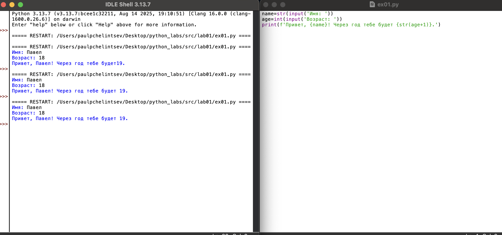
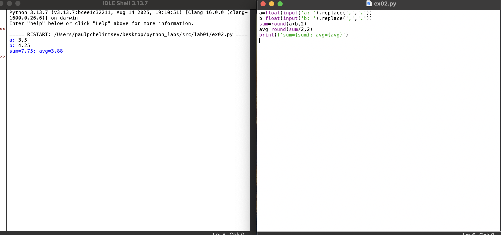
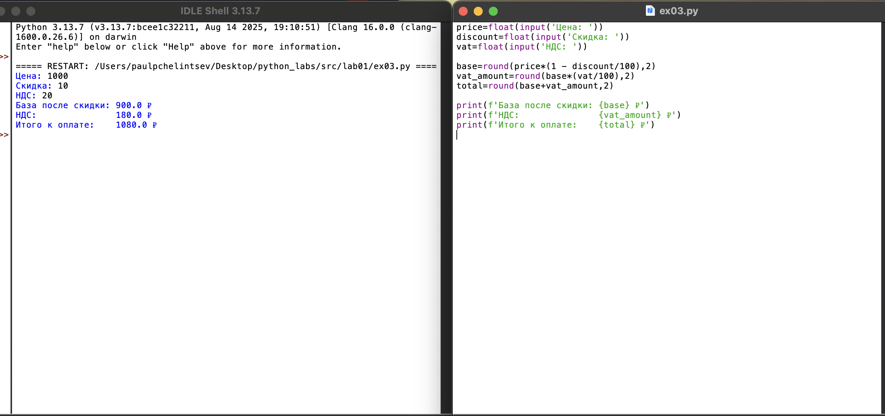
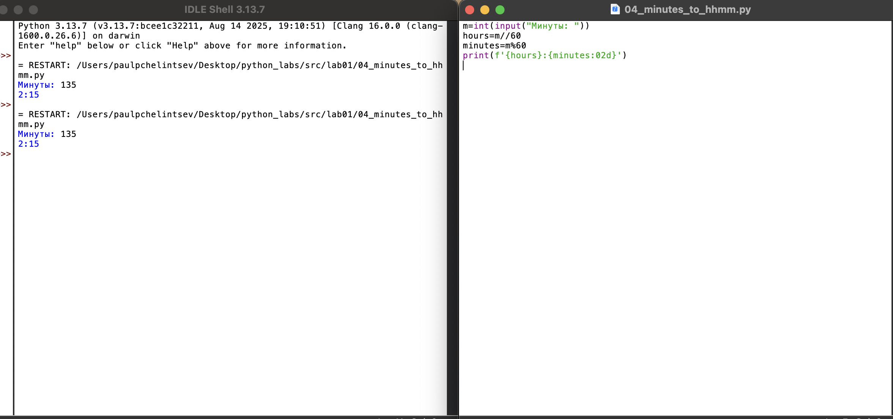
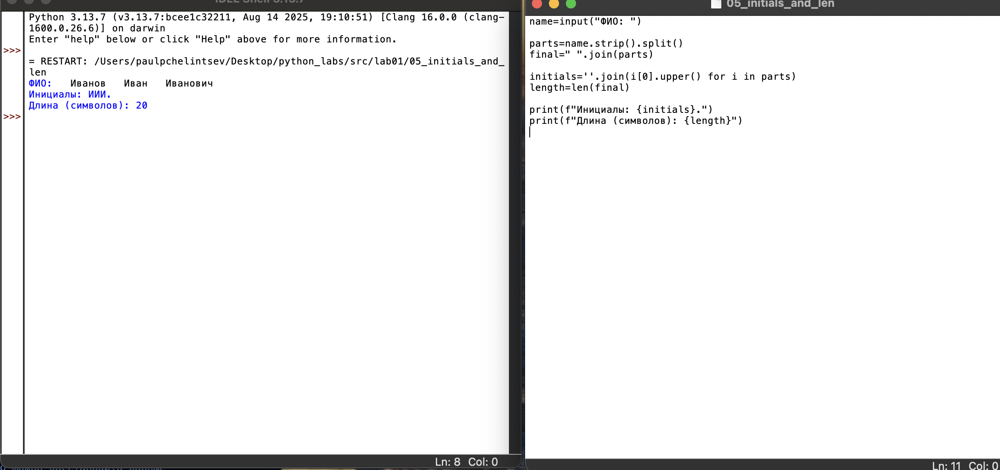
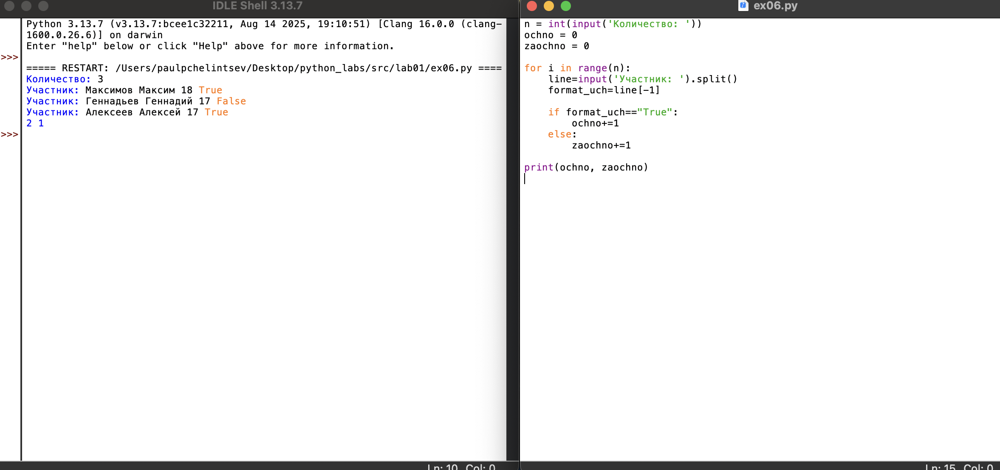
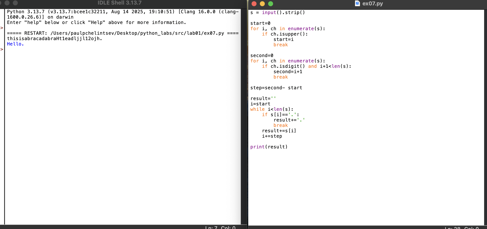
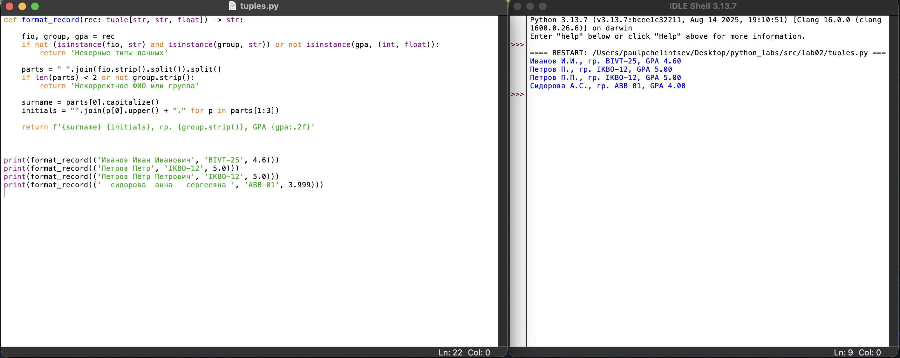
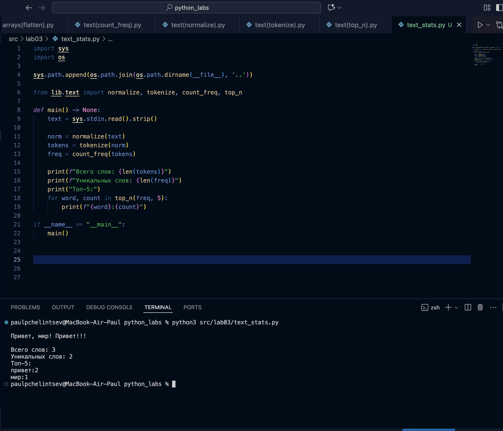

# Лабораторная работа 1
## Задание 1



```
name=str(input('Имя: '))
age=int(input('Возраст: '))
print(f'Привет, {name}! Через год тебе будет {age+1}.')
```

## Задание 2



```
a=float(input('a: ').replace(',','.'))
b=float(input('b: ').replace(',','.'))
sum=round(a+b,2)
avg=round(sum/2,2)
print(f'sum={sum}; avg={avg}')
```

## Задание 3



```
price=float(input('Цена: '))
discount=float(input('Скидка: '))
vat=float(input('НДС: '))

base=round(price*(1 - discount/100),2)
vat_amount=round(base*(vat/100),2)
total=round(base+vat_amount,2)

print(f'База после скидки: {base} ₽')
print(f'НДС:               {vat_amount} ₽')
print(f'Итого к оплате:    {total} ₽')
```

## Задание 4



```
m=int(input("Минуты: "))
hours=m//60
minutes=m%60
print(f'{hours}:{minutes:02d}')
```

## Задание 5



```
name=input("ФИО: ")

parts=name.strip().split()
final=" ".join(parts)

initials=''.join(i[0].upper() for i in parts)
length=len(final)

print(f"Инициалы: {initials}.")
print(f"Длина (символов): {length}")
```

## Задание 6



```
n = int(input('Количество: '))
ochno = 0
zaochno = 0

for i in range(n):
    line=input('Участник: ').split()
    format_uch=line[-1]

    if format_uch=="True":
        ochno+=1
    else:  
        zaochno+=1

print(ochno, zaochno)
```

## Задание 7



```
s = input().strip()

start=0
for i, ch in enumerate(s):
    if ch.isupper():
        start=i
        break

second=0
for i, ch in enumerate(s):
    if ch.isdigit() and i+1<len(s):
        second=i+1
        break

step=second- start

result=''
i=start
while i<len(s):
    if s[i]=='.':
        result+='.'
        break
    result+=s[i]
    i+=step

print(result)
```


# Лабораторная работа 2
## Задание 1

### arrays(min_max)
.png)

```
from typing import List, Tuple

def min_max(nums: List[float|int]) -> Tuple[float|int, float|int]:
    if not nums:
        return 'ValueError'   

    min_val = max_val = nums[0]
    for x in nums[1:]:
        if x < min_val:
            min_val = x
        if x > max_val:
            max_val = x

    return min_val, max_val
```

### arrays(unique_sorted)
.png)

```
from typing import List

def unique_sorted(nums: List[float | int]) -> List[float | int]:
    unique: List[float | int] = []
    
    for x in nums:
        if x not in unique:
            unique.append(x)
    
    unique.sort()
    
    return unique
```

### arrays(flatten)
.png)

```
from typing import List

def flatten(mat: List[list | tuple]) -> List:
    result: List = []
    for row in mat:
        if not isinstance(row, (list, tuple)):
            return ('TypeError')
        for elem in row:
            result.append(elem)
    return result
```

## Задание B

### matrix(transpose)
.png)

```
from typing import List

def transpose(mat: List[List[float|int]]) -> List[List]:
    if not mat:
        return []

    row_len = len(mat[0])
    if any(len(row) != row_len for row in mat):
        return 'ValueError'
    
    return [list(col) for col in zip(*mat)]
```

### matrix(row_sums)
.png)

```
from typing import List

def row_sums(mat: List[List[float|int]]) -> List[float]:
    if not mat:
        return []
    
    row_len = len(mat[0])
    if any(len(row) != row_len for row in mat):
        return 'ValueError'
    
    return [sum(row) for row in mat]
```

### matrix(col_sums)
.png)

```
from typing import List

def col_sums(mat:List[List[float|int]]) -> List[float]:
    if not mat:
        return []
    
    row_len = len(mat[0])
    if any(len(row) != row_len for row in mat):
        return 'ValueError'
    
    return [sum(row[i] for row in mat) for i in range(row_len)]
```

## Задание C



```
def format_record(rec: tuple[str, str, float]) -> str:

    fio, group, gpa = rec
    if not (isinstance(fio, str) and isinstance(group, str)) or not isinstance(gpa, (int, float)):
        return 'Неверные типы данных'
    
    parts = " ".join(fio.strip().split()).split()
    if len(parts) < 2 or not group.strip():
        return 'Некорректное ФИО или группа'
    
    surname = parts[0].capitalize()
    initials = "".join(p[0].upper() + "." for p in parts[1:3])
    
    return f'{surname} {initials}, гр. {group.strip()}, GPA {gpa:.2f}'
```


# Лабораторная работа 3
## Задание A

### normalize
.png)

```
import re

def normalize(text: str, *, casefold: bool = True, yo2e: bool = True) -> str:
    text = re.sub(r'[\r\n\t\f\v]', ' ', text)

    if yo2e:
        text = text.replace('ё', 'е').replace('Ё', 'Е')

    if casefold:
        text = text.casefold()

    text = re.sub(r'\s+', ' ', text).strip()

    return text

print(normalize('ПрИвЕт\nМИр\t'))
print(normalize('ёжик, Ёлка'))
print(normalize('Hello\r\nWorld'))
print(normalize('  двойные   пробелы  '))
```

### tokenize
.png)

```
import re

def tokenize(text: str) -> list[str]:
    return re.findall(r'\w+(?:-\w+)*', text, flags=re.UNICODE)

print(tokenize('привет мир'))
print(tokenize('hello,world!!!'))
print(tokenize('по-настоящему круто'))
print(tokenize('2025 год'))
print(tokenize('emoji 😀 не слово'))
```

### count_freq
.png)

```
def count_freq(tokens: list[str]) -> dict[str, int]:
    freq: dict[str, int] = {}
    for token in tokens:
        freq[token] = freq.get(token, 0) + 1

    sorted_items = sorted(freq.items(), key=lambda x: (-x[1], x[0]))

    return dict(sorted_items)

print(count_freq(['a', 'b', 'a', 'c', 'b', 'a']))
print(count_freq(['bb', 'aa', 'bb', 'aa', 'cc']))
```

### top_n
.png)

```
def top_n(freq: dict[str, int], n: int = 5) -> list[tuple[str, int]]:
    sorted_items = sorted(freq.items(), key=lambda x: (-x[1], x[0]))
    return sorted_items[:n]

freq1 = {'a': 3, 'b': 2, 'c': 1}
print(top_n(freq1, n=2))

freq2 = {'bb': 2, 'aa': 2, 'cc': 1}
print(top_n(freq2, n=2))
```

## Задание B

### text_stats


```
import sys
import os

sys.path.append(os.path.join(os.path.dirname(__file__), '..'))

from lib.text import normalize, tokenize, count_freq, top_n

def main() -> None:
    text = sys.stdin.read().strip()

    norm = normalize(text)
    tokens = tokenize(norm)
    freq = count_freq(tokens)

    print(f"Всего слов: {len(tokens)}")
    print(f"Уникальных слов: {len(freq)}")
    print("Топ-5:")
    for word, count in top_n(freq, 5):
        print(f"{word}:{count}")

if __name__ == "__main__":
    main()
```


